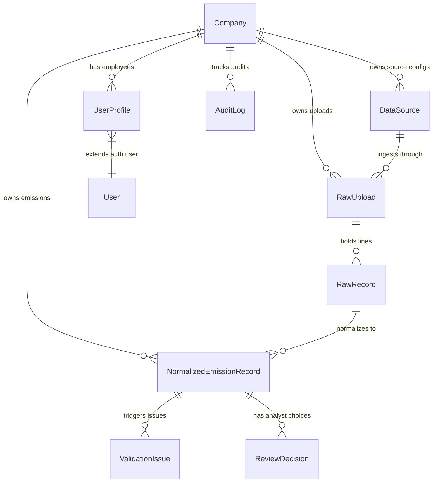

# Data Model Documentation

This document describes the database schema designed for the Breathe ESG Tech Ingestion and Audit platform.

## Database Schema Diagram



## Schema Entities

### 1. `Company` (Tenant Table)
* **Purpose**: Serves as the primary tenant container. All transactional data (Uploads, RawRecords, NormalizedEmissionRecords, AuditLogs) is partitioned by `company_id`.
* **Fields**:
  - `id`: UUID (Primary Key)
  - `name`: VARCHAR (Tenant Name)
  - `created_at`: TIMESTAMP

### 2. `UserProfile` (Auth Extender)
* **Purpose**: Extends Django's built-in `User` model, linking each user to a `Company` tenant and assigns a specific role (`analyst`, `auditor`, `admin`).
* **Fields**:
  - `user`: OneToOneField (User)
  - `company`: ForeignKey (Company)
  - `role`: VARCHAR (Choices: Sustainability Analyst, ESG Auditor, Admin)

### 3. `DataSource`
* **Purpose**: Defines configuration for data pipelines. A company can have multiple sources (e.g. multiple plant SAP exports, multiple utility portals, and travel APIs).
* **Fields**:
  - `id`: UUID (Primary Key)
  - `company`: ForeignKey (Company)
  - `name`: VARCHAR (Source Name)
  - `source_type`: VARCHAR (Choices: `sap_fuel`, `utility_electricity`, `corporate_travel`)
  - `active`: BOOLEAN

### 4. `RawUpload`
* **Purpose**: Logs metadata for each execution of a file upload or API synchronization. Helps trace what files came in, when, by whom, and their overall parse status.
* **Fields**:
  - `id`: UUID (Primary Key)
  - `company`: ForeignKey (Company)
  - `data_source`: ForeignKey (DataSource)
  - `upload_type`: VARCHAR (Choices: `file`, `api`)
  - `filename`: VARCHAR (Name of uploaded CSV, null for API)
  - `status`: VARCHAR (Choices: `pending`, `processing`, `completed`, `failed`)
  - `error_message`: TEXT (Stack trace or error messages if failed)
  - `uploaded_by`: ForeignKey (User)
  - `created_at`: TIMESTAMP

### 5. `RawRecord` (Immutable Source of Truth)
* **Purpose**: Holds the exact, unmodified row from the source CSV or API response as a JSON object. This is critical for **auditability** and **lineage tracing**—we can always compare normalized data back to the exact byte sequence that entered the system.
* **Fields**:
  - `id`: UUID (Primary Key)
  - `raw_upload`: ForeignKey (RawUpload)
  - `row_index`: INTEGER (Row or line number in the source data)
  - `raw_data`: JSONField (Exact raw key-value pairs)
  - `created_at`: TIMESTAMP

### 6. `NormalizedEmissionRecord` (Unified Target Schema)
* **Purpose**: The main unified record representing carbon activity. Normalizes mixed source columns into a unified data structure, applies unit conversions and emission factors, and tracks validation/review state.
* **Fields**:
  - `id`: UUID (Primary Key)
  - `company`: ForeignKey (Company)
  - `raw_record`: ForeignKey (RawRecord, Nullable)
  - `source_type`: VARCHAR (Choices: `sap_fuel`, `utility_electricity`, `corporate_travel`)
  - `scope_category`: INTEGER (Choices: 1 = Scope 1: Fuel, 2 = Scope 2: Electricity, 3 = Scope 3: Travel)
  - `activity_type`: VARCHAR (Normalized fuel/activity type e.g. `diesel`, `electricity`, `flight_economy`)
  - `facility_or_plant`: VARCHAR (Associated facility, cost center, plant, or meter ID)
  - `transaction_date`: DATE (Activity date)
  - `billing_period_start`: DATE (For billing cycles, start)
  - `billing_period_end`: DATE (For billing cycles, end)
  - `raw_quantity`: DECIMAL (Original volume/quantity)
  - `raw_unit`: VARCHAR (Original unit e.g. `TO`, `M Menge`, `KG`)
  - `normalized_quantity`: DECIMAL (Converted quantity)
  - `normalized_unit`: VARCHAR (Standardized unit e.g. `L`, `kWh`, `km`)
  - `emission_factor`: DECIMAL (kg CO2e per normalized unit)
  - `calculated_co2e`: DECIMAL (Carbon footprint in kg CO2e)
  - `validation_status`: VARCHAR (Choices: `valid`, `suspicious`, `failed`)
  - `review_status`: VARCHAR (Choices: `pending`, `approved`, `rejected`)
  - `approved_by`: ForeignKey (User, Nullable)
  - `approved_at`: TIMESTAMP (Nullable)
  - `is_locked`: BOOLEAN (Lock flag)

### 7. `ValidationIssue`
* **Purpose**: Detail for any warning or error flagged on a record. Ensures analysts know exactly *why* a record is failed or suspicious.
* **Fields**:
  - `id`: UUID (Primary Key)
  - `emission_record`: ForeignKey (NormalizedEmissionRecord)
  - `issue_type`: VARCHAR (e.g. `negative_value`, `overlapping_period`, `duplicate`, `out_of_bounds`)
  - `severity`: VARCHAR (Choices: `error` = Blocks approval, `warning` = Needs comment justification to override)
  - `message`: TEXT (Analyst-facing explanation)

### 8. `ReviewDecision`
* **Purpose**: Stores the justification comments and audit trail for approval overrides and rejections.
* **Fields**:
  - `id`: UUID (Primary Key)
  - `emission_record`: ForeignKey (NormalizedEmissionRecord)
  - `decision`: VARCHAR (Choices: `approved`, `rejected`)
  - `reason`: TEXT (Justification message)
  - `decided_by`: ForeignKey (User)
  - `created_at`: TIMESTAMP

### 9. `AuditLog`
* **Purpose**: Chronological history of actions (upload, normalize, approve, reject, edit) performed on records.
* **Fields**:
  - `id`: UUID (Primary Key)
  - `company`: ForeignKey (Company)
  - `user`: ForeignKey (User, Nullable for system tasks)
  - `action`: VARCHAR (e.g., `UPLOAD`, `NORMALIZE`, `APPROVE`, `REJECT`)
  - `target_type`: VARCHAR (e.g. `NormalizedEmissionRecord`, `RawUpload`)
  - `target_id`: UUID (ID of target row)
  - `changes`: JSONField (Diff of changes)
  - `created_at`: TIMESTAMP

### 10. `UnitConversionMap`
* **Purpose**: Contains factors to convert raw units to target units.
* **Fields**:
  - `from_unit`: VARCHAR (e.g. `TO`, `KG`, `M3`)
  - `to_unit`: VARCHAR (e.g. `L`, `KWH`)
  - `conversion_factor`: DECIMAL

### 11. `EmissionFactor`
* **Purpose**: Standard greenhouse gas emission coefficients (e.g., DEFRA, EPA eGRID) mapped by year.
* **Fields**:
  - `activity_type`: VARCHAR
  - `year`: INTEGER
  - `factor`: DECIMAL (kg CO2e per standardized unit)
  - `source_reference`: VARCHAR

---

## Architectural Decisions & Defensibility

### 1. ORM-Level Mutability Locking
To guarantee auditability, records that are approved must become immutable. We implement this check inside Django's `save()` method in `NormalizedEmissionRecord`:
```python
    def save(self, *args, **kwargs):
        if self.pk:
            try:
                original = NormalizedEmissionRecord.objects.get(pk=self.pk)
                if original.is_locked and not kwargs.pop('force_unlock', False):
                    raise ValidationError("This record is approved and locked. It is immutable and cannot be updated.")
            except NormalizedEmissionRecord.DoesNotExist:
                pass
        super().save(*args, **kwargs)
```
This blocks any API-level or Django-admin updates to locked records. Only a developer explicitly passing `force_unlock=True` in python code can override it.

### 2. Normalized vs Raw Separation
Storing the raw input row in `RawRecord` separates the database structure of the enterprise sources from the internal calculation engine. If an emission factor is updated or a bug in normalization is fixed, we can re-process the exact same `RawRecord` JSON objects without requiring the analyst to re-upload files.
